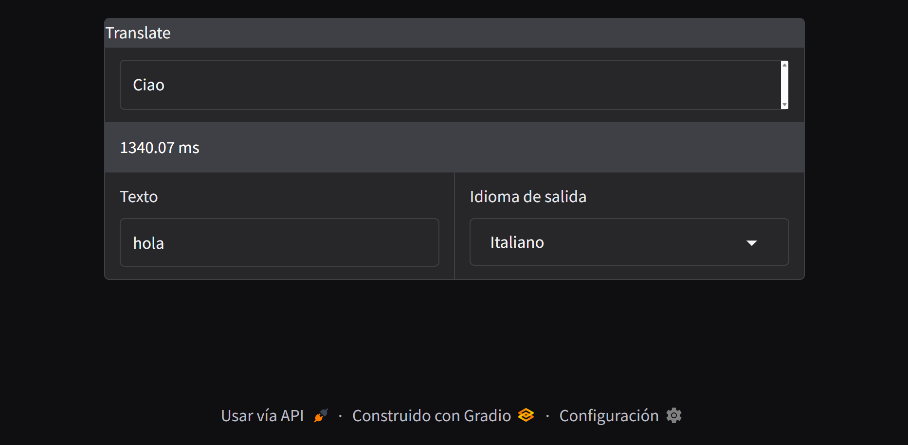
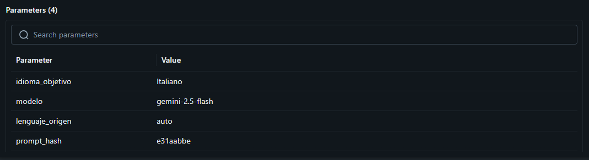
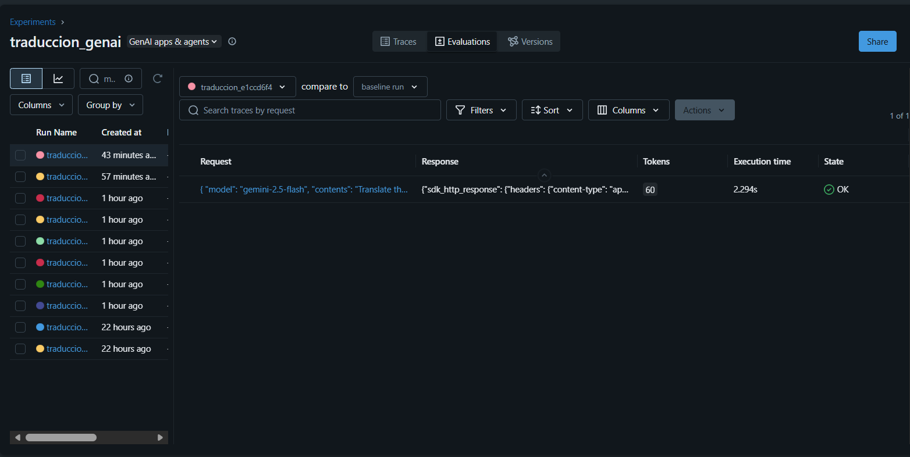
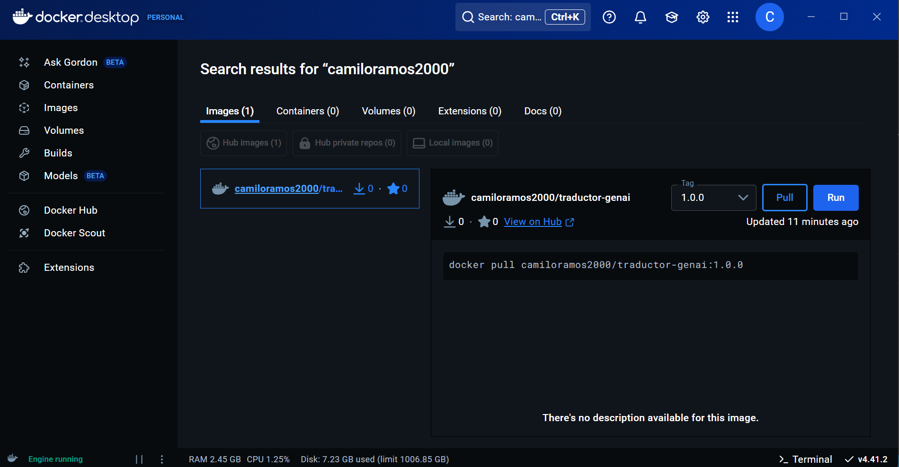

<div align="center">


</div>


# 🌐 Traductor Inteligente con Tracking en MLflow y Despliegue Dockerizado

Este proyecto implementa un traductor basado en **Gen-AI** con interfaz en **Gradio**, y registra automáticamente los detalles de cada traducción en **MLflow** (parámetros, métricas y artefactos).  
Todo el sistema está **contenedorizado con Docker**, asegurando portabilidad y fácil despliegue en cualquier entorno.

---

## 🖼️ Evidencias Visuales

### 1. Interfaz Gradio funcionando


### 2. Seguimiento en MLflow

#### Parámetros (Params)


#### Métricas (Metrics)


#### Artefactos (Artifacts)


---

## 🧱 Arquitectura del Sistema

```bash
Usuario → Gradio UI → Traductor Gen-AI
                               ↓
                          MLflow Tracking
                    (Params, Metrics, Artifacts)
```
---

## 🐳 Ejecución con Docker

### 1. Crear network y volúmenes
```bash
docker network create translation-net
docker volume create mlflow_data
docker volume create mlflow_artifacts
```

### 2. Ejecutar el Traductor (desde Docker Hub)
Traemos la imagen del DockerHub:
#### camiloramos2000/traductor-genai:1.0.0 en DockerHub

```bash
docker pull camiloramos2000/traductor-genai:1.0.0
```
> Reemplazar `TU_API_KEY` con tu API real.
```bash
docker run -it -d   --name traductor-genai   -p 7860:7860   --network translation-net   -e MLFLOW_URI="http://mlflow:5000"   -e GENAI_API_KEY="TU_API_KEY"   camiloramos2000/traductor-genai:1.0.0
```
Acceso interfaz Gradio:  
👉 http://localhost:7860

### 3. Ejecutar el servidor MLflow
traemos la imagen de DockerHub:
```bash
docker pull ghcr.io/mlflow/mlflow
```
```bash
docker run -d -it --rm   --name mlflow   --network translation-net   -p 5000:5000   -v mlflow_data:/mlflow   -v mlflow_artifacts:/mlflow/artifacts   mlflow   mlflow server     --backend-store-uri sqlite:////mlflow/mlflow.db     --default-artifact-root /mlflow/artifacts     --host 0.0.0.0     --port 5000
```
Acceso MLflow:  
👉 http://localhost:5000

---

## 💡 Funcionamiento Interno

- Cada traducción genera:
  - **Parámetros:** idioma destino, longitud del texto
  - **Métricas:** tiempo de traducción, conteo de tokens
  - **Artefactos:** logs e historial de traducciones

- Esto permite comparar versiones del modelo, rendimiento y calidad.

---

## 🏁 Conclusiones

| Componente | Estado |
|----------|:------:|
| Traductor Gen-AI | ✅ |
| Interfaz Gradio | ✅ |
| Tracking con MLflow | ✅ |
| Contenerización con Docker | ✅ |
| Reproducibilidad completa | ✅ |

---

## 👨‍💻 Autor

**Camilo Andrés Ramos Cotes (CRC)**  
Universidad del Magdalena  
GitHub: https://github.com/camiloramos2000
